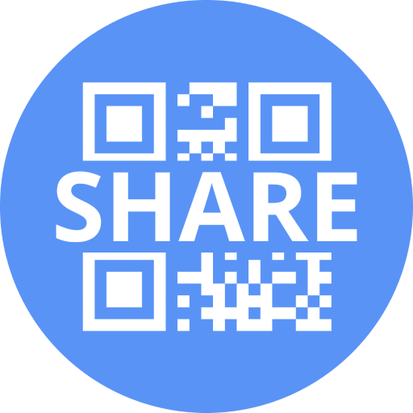

#  Share My Thing 

A Wear OS app that enables you to share links, contact details, and more via QR code or plain text. An optional phone companion app makes editing easier and allows for multi-line content with near-instant sync. No account creation required.

## Features

- 3 Item types: Choose between plain text, QR code, or both to influence how the item appears on tiles and within the app.
- Watch surfaces: Add up to five tile slots and five complication slots, each linked to an item.
- Standalone watch app: Works without the phone app, add or edit items on the watch using the native keyboard. If you want multi-line editing, you can install the mobile companion.

## Requirements

- Watch: Wear OS 3+ 
- Phone (optional): Android 11+ 
- Sync: Phone and watch paired with the same Google account

## Privacy

See [docs/PRIVACY.md](docs/PRIVACY.md). In short: your items stay on your devices; there is no analytics or background server.

## License

This project uses the [GNU General Public License v3.0](https://www.gnu.org/licenses/gpl-3.0.html). See [LICENSE](LICENSE) for the full legal text. In short: you can use, change, and share it freely. If you distribute a modified version, you must offer it under the same license and share the source too, so the work (and its derivatives) stay open. You cannot take this code, tweak it, and ship it as a closed product.

## About

Inspired by my own need to be able to share my website link, phone number, and have contact details easily accessible on the watchface. Please [open an issue](https://github.com/kattcrazy/Share-My-Thing/issues) if something breaks or you have an idea.

If Share My Thing is helpful, consider supporting me [here](https://kattcrazy.nz/product/support-me/) :)
