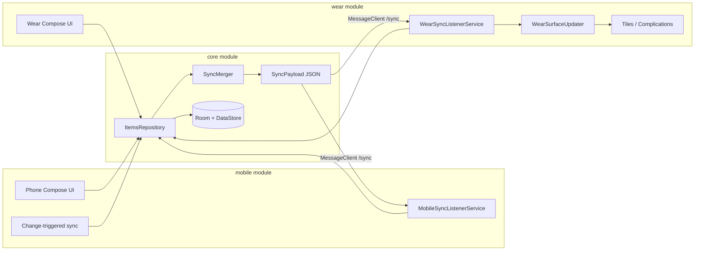

# Mobile Companion App Plan

> **Status: implemented locally (not yet committed).** The module split, sync engine, wear refactor, phone app, and build script updates are in the working tree. Run `.\build-local.ps1` to produce APKs, then smoke-test on paired phone + watch.

## What was done (summary)

The single `:app` Wear module was split into three modules. Shared data and sync live in `:core`; the existing watch app moved to `:wear`; a new phone app was added in `:mobile`.

### `:core` — shared library

- Moved **Room**, **DataStore**, **ItemsRepository**, **QrCodeGenerator**, and models into `core/`.
- Extended `DisplayItem` with `uuid`, `updatedAtMillis`, and soft-delete (`deleted` flag).
- Added **Room v1 → v2 migration** that backfills UUIDs and timestamps for existing rows (safe for watch testers upgrading).
- Added **sync engine** in `core/src/main/java/com/sharemyththing/sync/`:
  - `SyncPayload` / `SyncItemRecord` / `SyncSlotAssignment` (JSON via `org.json`)
  - `SyncMerger` — last-write-wins per item UUID and per slot assignment
  - `SyncEngine` — merge + apply helper
  - `SyncRepository` — phone-initiated round-trip via `MessageClient` (`/sync/request` → `/sync/response`)
- `ItemsRepository` now accepts an optional `SurfaceUpdateListener` callback instead of calling tile/complication APIs directly.
- `SurfacePreferences` stores assignment timestamps for sync; slot LWW uses `updatedAtMillis`.

### `:wear` — renamed from `:app`

- Folder renamed `app/` → `wear/`; `settings.gradle.kts` now includes `:core`, `:wear`, `:mobile`.
- **WearSurfaceUpdater** (`wear/WearSurfaceUpdater.kt`) implements targeted tile/complication refresh (same behaviour as before).
- **WearSyncListenerService** handles incoming `/sync/request` from phone, merges, applies, replies with merged payload, and triggers surface updates.
- `ShareMyThingApplication` wires repository + surface updater + sync repository.
- **`com.google.android.wearable.standalone = true`** kept in manifest.
- `SurfaceSlot.labelRes` moved to wear-only extension (`data/SurfaceSlotLabels.kt`).

### `:mobile` — new phone app

- Same **`applicationId = "com.sharemyththing"`** as wear.
- Material 3 Compose UI with screen parity: list, QR/text detail, QR tips, edit, tiles & complications, slot picker.
  - **Phone-only extras:**
  - Multiline content field (`minLines = 4`, `maxLines = 12`) in `EditItemScreen`
  - Tooltips on edit fields and tiles screen
  - **Change-triggered sync** — after save, delete, or slot assignment, phone pushes to watch silently (no sync button)
  - **Support banner** on list screen (not dismissible) → opens [Support Me](https://kattcrazy.nz/product/support-me/) via Custom Tabs
- **MobileSyncListenerService** handles watch-initiated `/sync/request` when the watch pushes sync to the phone.

### Build & install

- `build-local.ps1` builds **both** modules and copies:
  - `dist/ShareMyThing-wear-debug.apk` (watch)
  - `dist/ShareMyThing-mobile-debug.apk` (phone)
- Release variants: `ShareMyThing-wear-release-unsigned.apk` / `ShareMyThing-mobile-release-unsigned.apk`
- New flags: `-InstallWear`, `-InstallMobile` (replaces old single `-Install`)

**Install examples:**

```powershell
# Watch
adb -s <watch-serial> install -r "...\dist\ShareMyThing-wear-debug.apk"

# Phone
adb -s <phone-serial> install -r "...\dist\ShareMyThing-mobile-debug.apk"
```

**Play Console (when publishing):** one listing, same `applicationId`, two APKs/AABs (phone + wear), same signing key.

---

## Current module layout

| Module | Role |
|--------|------|
| `:core` | Room, DataStore, models, `ItemsRepository`, `QrCodeGenerator`, sync engine |
| `:wear` | Watch UI, tiles, complications, `WearSurfaceUpdater`, `WearSyncListenerService` |
| `:mobile` | Phone Material3 UI, change-triggered sync, support banner, `MobileSyncListenerService` |

```
settings.gradle.kts → include(":core", ":wear", ":mobile")

core/src/main/java/com/sharemyththing/
├── data/          AppDatabase, DisplayItem, ItemsRepository, SurfacePreferences, SurfaceSlot, …
├── sync/          SyncPayload, SyncMerger, SyncEngine, SyncRepository, SyncPaths
└── util/          QrCodeGenerator

wear/src/main/java/com/sharemyththing/
├── wear/          WearSurfaceUpdater
├── sync/          WearSyncListenerService
├── tile/          SlotTileService, TileLayoutBuilder
├── complication/  SlotComplicationService
└── ui/            (existing Wear Compose screens)

mobile/src/main/java/com/sharemyththing/
├── ui/            list, detail, edit, settings, components (SupportBanner)
├── sync/          MobileSyncListenerService
└── presentation/  MainActivity, Theme
```

## Sync flow

1. **Phone edits an item or slot** → `ItemsViewModel` saves locally, then calls `syncRepository.syncWithWatch()` in the background.
2. **Watch** `WearSyncListenerService` merges with local data, applies to DB, replies with merged payload on `/sync/response`, refreshes affected tiles/complications.
3. **Phone** applies the merged payload locally (no UI; failures are silent if no watch is connected).
4. **Watch-initiated sync:** watch can send `/sync/request` to phone; `MobileSyncListenerService` merges and replies (no sync button on watch).

Sync requires phone and watch **paired** with Google Play services. UI shows “No watch connected” when no node is available.

## Architecture



---

## Progress so far (Wear app — baseline before companion work, commit d47d086)

Historical reference for what existed **before** the companion implementation. The items below marked “was missing” are now done in `:core` / `:mobile`.

### Repository & build (historical)

| Item | Value |
|------|-------|
| **GitHub** | https://github.com/kattcrazy/Share-My-Thing (`main`) |
| **Baseline commit** | `d47d086` — *Add QR tips screen and reduce battery, RAM, and APK footprint.* |
| **Package / applicationId** | `com.sharemyththing` |
| **Module layout (was)** | Single module `:app` only |
| **Debug output (was)** | `dist/ShareMyThing-debug.apk` |
| **Debug output (now)** | `dist/ShareMyThing-wear-debug.apk` + `dist/ShareMyThing-mobile-debug.apk` |

### Wear features (unchanged behaviour)

- Store “things” (QR codes or plain text); 5 tiles + 5 complications
- Targeted surface updates, QR LRU cache, QR tips screen, standalone watch operation
- All of this now lives in `:wear` + `:core` with the same user-facing behaviour

---

## Remaining / follow-up

- **Smoke-test build** — run `.\build-local.ps1` and install both APKs on paired devices; confirm sync end-to-end.
- **Commit & push** — changes are local only until committed.
- **Watch auto-sync on connect** — plan noted “watch syncs as soon as it can connect to phone”; listener services are in place, but there is no automatic trigger when a phone node becomes reachable (sync is manual from phone, or if watch sends a request).
- **Release signing** — release APKs are unsigned; configure signing before Play upload.

## Risks / notes

- First sync after watch upgrade: existing items get UUIDs via migration; phone starts empty until first sync (expected).
- Bidirectional merge uses UUID + timestamps; auto-increment `Long` ids remain local-only.
- Phone module does **not** declare `android.hardware.type.watch`; wear module does.
- ProGuard rules updated in wear and mobile for core/sync/util classes.
