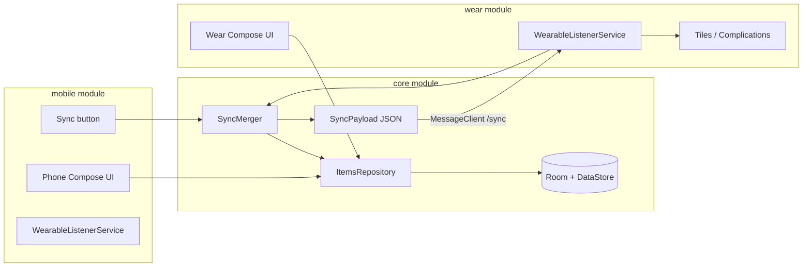

# Mobile Companion App Plan

> **Handoff doc for another AI.** Read the **Progress so far** section first for what already exists on the Wear app before starting module split / sync / phone UI work.

## Progress so far (Wear app — complete and shipped)

### Repository & build

| Item | Value |
|------|-------|
| **Project root** | This repo (plan file: `mobile_companion_app.plan.md` at root) |
| **GitHub** | https://github.com/kattcrazy/Share-My-Thing (`main`) |
| **Latest commit** | `d47d086` — *Add QR tips screen and reduce battery, RAM, and APK footprint.* |
| **Package / applicationId** | `com.sharemyththing` |
| **Module layout today** | Single module `:app` only (`settings.gradle.kts` → `include(":app")`) |
| **Build script** | `build-local.ps1` — copies project to `%LOCALAPPDATA%\ShareMyThing-build` (cloud/sync paths break KSP), runs Gradle, copies APK to `dist/` |
| **Debug output** | `dist/ShareMyThing-debug.apk` |
| **Release** | R8 minify + shrink resources enabled; `app/proguard-rules.pro` keeps Room, ZXing, tile/complication services |

**Commit history (newest first):**

1. `d47d086` — QR tips screen + performance optimizations (see below)
2. `e015ba8` — QR tile top padding 24dp
3. `a858887` — Wear polish: tiles, slots, UI, scroll padding, tile placement fixes
4. `719b79f` — Initial Wear OS app

### What the Wear app does today

**Purpose:** Store short “things” (QR codes or plain text) on a watch and surface them via in-app screens, **5 tiles**, and **5 watch-face complications**.

**Item types** (`ItemType` enum): `QR_CODE`, `TEXT`.

**Data layer:**

- **Room** — `DisplayItem` entity (`id`, `title`, `content`, `type`, `sortOrder`). Auto-increment `Long` id only — **no uuid / updatedAt yet** (required before bidirectional sync).
- **DataStore** — `SurfacePreferences`: slot → item id assignments, which slots are “placed on watch”.
- **Repository** — `ItemsRepository` owns CRUD, slot assignment, and **targeted** tile/complication refresh (not all 10 surfaces on every change).
- **Application singleton** — `ShareMyThingApplication` exposes one shared `ItemsRepository`; tile/complication services reuse it.

**Navigation** (`AppScreen` / `AppNavHost`):

- Item list
- QR detail, text detail
- **QR tips** (`QrTipsScreen`) — help screen linked from QR detail via `?` icon
- Edit item (create/update)
- Tiles & complications overview
- Per-slot item picker

**Watch surfaces (10 slots):**

- `SurfaceSlot` — `TILE_1`…`TILE_5`, `COMPLICATION_1`…`COMPLICATION_5`
- Tiles: `SlotTileService` subclasses + `TileLayoutBuilder` (Protolayout Material3)
- Complications: `SlotComplicationService` subclasses (SHORT_TEXT, tap opens app detail)
- QR tiles mirror in-app QR detail: white QR box + centered title (no content/edit on tile)
- Text tiles: vertically centered title + content
- Configure-from-tile navigation supported; placement tracked in DataStore

**UI stack:**

- Wear Compose (Material for Wear), not phone Material3
- `ItemsViewModel` — flows for items, slot assignments, surfaces placed on watch
- Shared scroll padding helper (`WearScrollPadding.kt`)
- Theme is minimal (`presentation/theme/Theme.kt`) — functional, not heavily themed

**QR generation** (`QrCodeGenerator`):

- ZXing-based; bounded LRU cache (6 entries), `RGB_565` bitmaps, recycle on evict
- Selective cache invalidation when item content changes
- Used by QR detail screen and tile resource pipeline (single gen path for tiles)

**Performance work already done (do not redo):**

- Targeted `requestSurfaceUpdate(slot)` instead of refreshing all tiles/complications
- No launch-time refresh of all 10 surfaces
- Singleton repository from Application in tile/complication services
- QR generated once in `buildTileResources()`, not duplicated in layout
- Release APK shrinking; Compose/Wear tooling deps are `debugImplementation` only

**Not implemented yet (this plan’s scope):**

- `:core` / `:wear` / `:mobile` module split
- `uuid`, `updatedAtMillis`, Room v2 migration
- Wearable Data Layer sync (`SyncPayload`, `SyncMerger`, listeners)
- Phone companion app at all
- Multiline edit fields, phone tooltips, sync button, support banner

### Key files map (current `:app` module)

```
app/src/main/java/com/sharemyththing/
├── ShareMyThingApplication.kt      # singleton repository
├── data/
│   ├── DisplayItem.kt              # Room entity — needs uuid + updatedAt for sync
│   ├── ItemsRepository.kt          # CRUD + targeted surface updates
│   ├── SurfacePreferences.kt       # DataStore slot assignments
│   └── SurfaceSlot.kt              # 5 tiles + 5 complications
├── presentation/MainActivity.kt
├── ui/
│   ├── ItemsViewModel.kt
│   ├── navigation/AppNavHost.kt, AppScreen.kt
│   ├── list/ItemListScreen.kt
│   ├── detail/QrDetailScreen.kt, TextDetailScreen.kt, QrTipsScreen.kt, DetailHelpButton.kt
│   ├── edit/EditItemScreen.kt
│   └── settings/TilesComplicationsScreen.kt, SlotItemPickerScreen.kt
├── tile/SlotTileService.kt, TileLayoutBuilder.kt
├── complication/SlotComplicationService.kt
└── util/QrCodeGenerator.kt         # move to :core
```

### Constraints for the next AI

1. **Watch stays standalone** — keep `com.google.android.wearable.standalone = true` in wear manifest.
2. **Same applicationId** on wear + mobile for single Play listing.
3. **Do not break existing watch testers** — Room migration must backfill UUIDs for existing rows.
4. **Extract surface updates out of core** — `ItemsRepository.requestSurfaceUpdate` is wear-specific today; move to `WearSurfaceUpdater` in `:wear` when splitting modules.
5. **Build from local copy** — update `build-local.ps1` for multi-module; keep cloud-path workaround.
6. **User preference:** focused diffs, match existing Kotlin/Compose style, no over-engineering.

---

## Goal

Ship a **phone companion app** alongside the existing Wear app under the **same Play listing / `applicationId`** (`com.sharemyththing`), so internal testers install once per device type but count toward one app. The phone app mirrors watch functionality with these **phone-only extras**:

- Multiline text fields when editing items
- Tooltips on non-obvious controls
- **Sync** button (bidirectional merge with paired watch)
- Subtle banner linking to [Support Me](https://kattcrazy.nz/product/support-me/)

Watch behavior stays **standalone** (no phone required); sync is optional enhancement.

## Current state (before companion work)

- Single module [`app/`](app/) — Wear-only (`uses-feature watch`, tiles, complications, Wear Compose UI)
- [`AndroidManifest.xml`](app/src/main/AndroidManifest.xml) sets `com.google.android.wearable.standalone = true` (keep this)
- Data in Room ([`DisplayItem`](app/src/main/java/com/sharemyththing/data/DisplayItem.kt)) + DataStore ([`SurfacePreferences`](app/src/main/java/com/sharemyththing/data/SurfacePreferences.kt))
- IDs are auto-generated `Long` — **not safe for bidirectional sync** across devices
- Wear feature set is **production-ready for standalone use**; companion/sync/mobile UI is the remaining work

## Architecture



### Module split

| Module | Role |
|--------|------|
| `:core` (new Android library) | Room, DataStore, models, repository, QR util, **sync engine** |
| `:wear` (rename current `:app`) | Existing watch UI, tiles, complications; depends on `:core` |
| `:mobile` (new application) | Phone Material3 Compose UI; depends on `:core` |

Update [`settings.gradle.kts`](settings.gradle.kts): `include(":core", ":wear", ":mobile")`.

Both `:wear` and `:mobile` use **`applicationId = "com.sharemyththing"`** and the **same signing key** (required for Play multi-APK + Data Layer).

## 1. Shared data layer changes (`:core`)

**Stable sync identity** — extend [`DisplayItem`](app/src/main/java/com/sharemyththing/data/DisplayItem.kt):

- Add `uuid: String` (generated on insert, never changes)
- Add `updatedAtMillis: Long` (bump on every create/update/delete)
- Room migration `v1 → v2`: backfill UUIDs + timestamps for existing rows

**Bidirectional merge** (new `sync/` package in core):

- `SyncPayload`: items (uuid, title, content, type, sortOrder, updatedAt, deleted flag) + slot assignments (slot key → item uuid + assignment timestamp)
- `SyncMerger.merge(local, remote)`: deterministic **last-write-wins per uuid / per slot**; tombstones win if delete timestamp is newest
- `SyncRepository.syncWithWatch(context)`: orchestrates round-trip:
  1. Build local payload
  2. Send `/sync/request` via `MessageClient` to connected watch node
  3. Watch listener merges incoming payload with local, applies to DB, replies with merged payload
  4. Phone applies same merged payload locally
  5. Watch side triggers surface updates via `WearSurfaceUpdater`; phone shows success/error state

**Refactor [`ItemsRepository`](app/src/main/java/com/sharemyththing/data/ItemsRepository.kt)**:

- Move CRUD + flows to `:core`
- Move tile/complication `requestSurfaceUpdate()` to a small `:wear`-only `WearSurfaceUpdater` interface implemented in wear module (keeps tiles dependency out of core)
- Preserve existing **targeted** update behavior (only affected slots, not all 10)
- Keep `QrCodeGenerator` in `:core`; cache invalidation hooks stay on upsert/delete

Dependency: `com.google.android.gms:play-services-wearable` in `:core` (or thin `:sync` lib if you prefer isolation).

## 2. Wear module (`:wear`)

- Rename/move current [`app/`](app/) → `wear/`
- Keep manifest watch-only; **`standalone` stays `true`**
- Add `WearSyncListenerService` (extends `WearableListenerService`):
  - Handles `/sync/request` and `/sync/response`
  - Calls `SyncMerger` + applies to local DB
  - Calls `WearSurfaceUpdater` after apply
- No sync button on watch (per spec); watch edits stay local until phone sync
- Port existing optimizations: singleton repo in Application, targeted surface updates, QR tips screen, tile layouts as implemented

## 3. Phone module (`:mobile`)

New phone app with **Material 3 Compose** (standard `androidx.compose.material3`, not Wear Material3).

**Screens** (parity with watch, phone-optimized layout):

- Item list (FAB or top-bar Add)
- QR / text detail
- QR tips (optional parity with watch help screen)
- Edit item
- Tiles & complications + slot picker

Reuse navigation shape from [`AppNavHost.kt`](app/src/main/java/com/sharemyththing/ui/navigation/AppNavHost.kt) and [`ItemsViewModel`](app/src/main/java/com/sharemyththing/ui/ItemsViewModel.kt) pattern in `:mobile` (viewmodel depends on `:core` repository).

### Phone-only features

**Multiline text** — in mobile `EditItemScreen`:

- Title: single-line `OutlinedTextField`
- Content: `OutlinedTextField` with `minLines = 4`, `maxLines = 12`, vertical scroll inside field

**Tooltips** — `TooltipBox` / `PlainTooltip` on:

- Sync button: explains bidirectional watch sync
- Edit fields (title vs content vs QR URL/text)
- Tiles & complications screen (what slots mean)

**Sync button** — top app bar on main screens (or list screen only):

- Shows states: idle / syncing / success / no watch connected
- Calls `SyncRepository.syncWithWatch()`
- Disabled with tooltip when no paired watch node

**Support banner** — subtle `Surface` strip (e.g. below app bar on list screen):

- Copy like “Enjoying Share My Thing? Support development”
- Taps open https://kattcrazy.nz/product/support-me/ via `CustomTabsIntent`
- Dismissible; persist dismiss in DataStore (`support_banner_dismissed`)

## 4. Build & release

Update [`build-local.ps1`](build-local.ps1):

- Build `:wear:assembleDebug` and `:mobile:assembleDebug`
- Output `dist/ShareMyThing-wear-debug.apk` and `dist/ShareMyThing-mobile-debug.apk`

**Play Console** (when you publish):

- One app listing, same `applicationId`, two APKs/AAB artifacts (phone + wear), same signing key
- Testers on phone and watch both count toward that single app’s tester list

## 5. Implementation order

1. Create `:core`, move data + util; Room migration with uuid/timestamp
2. Rename `:app` → `:wear`, wire `:core`, extract `WearSurfaceUpdater` from repository surface-update logic
3. Implement sync payload + merger + wear listener; verify with adb paired emulator/device
4. Create `:mobile` shell + shared ViewModel/repository wiring
5. Port screens to phone Compose (list → detail → edit → tiles)
6. Add multiline fields, tooltips, sync button UI, support banner
7. Update build script + smoke-test both APKs

## Risks / notes

- **Bidirectional sync** needs uuid + timestamps; without this, auto-increment IDs will corrupt data across devices.
- Sync requires phone and watch **paired via Bluetooth** with Google Play services; UI must handle “watch not connected” gracefully.
- First sync after upgrade will migrate existing watch-only data with generated UUIDs; phone starts empty until first sync (expected).
- Phone module should **not** declare `android.hardware.type.watch`; wear module keeps it.
- When moving to `:core`, ensure ProGuard rules cover new modules; wear release already minifies.
